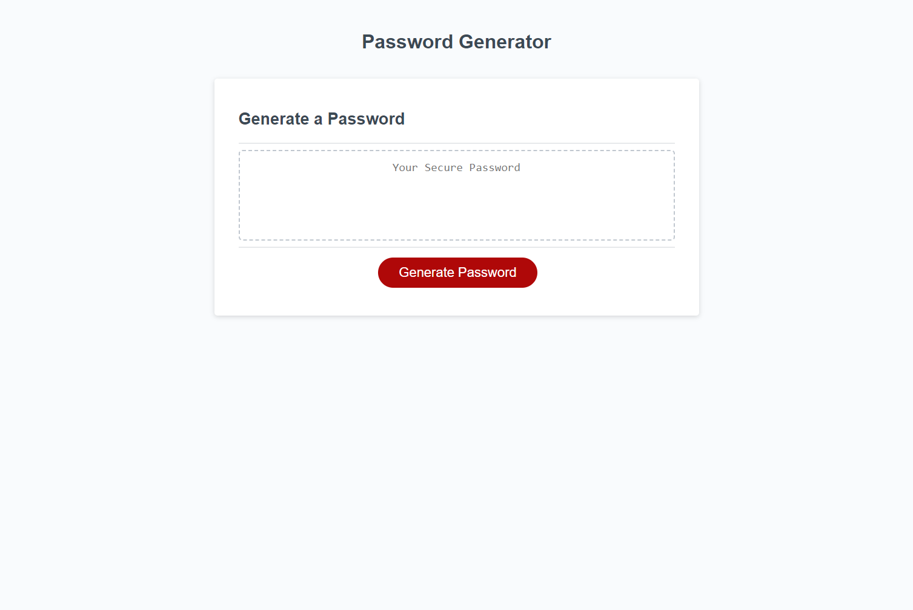

# Password Generator: 03iyeKZ8khsn
Application generates a password after recieving input from the user using alerts and prompt boxes

Passwords are generated after finding out the following:
* Desired length as a number between 8 and 128
* User must pick at leaset one of the desired character types
    * lowercase
    * uppercase
    * numbers
    * special characters
* After the input is accepted the application uses it to generate a password using math.floor and math.random
* Password is then retuned to the end user

Extra Steps:

The createPassword function will check if all requested types are included in the random password

This is occomplished by maintining an array of bools and indexs for which the characterlist switches to the next character set
By doing this I can take the random generated number and check which character set the random letter is from and update a tracking bool to true.
If all tracking is true then every case has been included, if false then it will recurssively call itself.

This project can be viewed by going to [https://chrisosbii.github.io/03iyeKZ8khsn/](https://chrisosbii.github.io/03iyeKZ8khsn/)

## Sources: 
https://github.com/coding-boot-camp/friendly-parakeet
https://courses.bootcampspot.com/courses/3169/assignments/50921?module_item_id=920973
